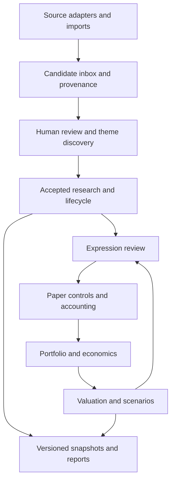

# MacroTrading — product and implementation blueprint

Version: 0.6.0  
Prepared: 19 September 2026  
Canonical repository: https://github.com/AInewbie/MacroTrading  
Purpose: describe the objectives, decisions and delivered behavior precisely enough for another LLM or engineering team to produce a different implementation.

## 1. How to use this blueprint

Treat the product behavior, financial units, state transitions, provenance requirements and acceptance examples as the specification. Python, SQLite, a particular UI framework, file names and module boundaries are choices in the reference implementation, not requirements for a replacement. A new implementation may use a different language, database, hosting model or visual design, provided it preserves these semantics or clearly documents a reviewed change.

This is a specification of a delivered research and paper-portfolio workbench plus its explicitly bounded extensions. It is not a claim that every original ambition is already implemented. Sections 3, 15 and 16 distinguish delivered functionality, validation evidence and remaining work.

## 2. Original objectives

The original ambition was a dynamic multi-asset macro portfolio tool: identify macro themes using economic information, news, research, blogs and alternative data; turn themes into expressions across equities, ETFs, indices, bonds, currencies, commodities and derivatives; understand their combined portfolio consequences; and ultimately support executable brokerage portfolios.

The user's subsequent requests made these operating needs concrete:

1. Use the GitHub code as the reproducible engine for analysis, not a separate conversational approximation.
2. Maintain a changing set of macro themes, evidence, catalysts, counterarguments and explicit invalidation conditions.
3. Produce a clear HTML review for each run, showing what changed, what is unknown and which portfolio decisions need attention.
4. Integrate research with portfolio risk and expressions while retaining human control over decisions, quantities and execution.
5. Keep data, calculations, application orchestration and display separate, with editable assumptions and recoverable state.
6. Make the dashboard understandable and usable, and document what exists rather than presenting future ideas as completed features.
7. Preserve unknown or stale information. Do not manufacture market observations, source support, calibrated confidence or an investment edge.

The user explicitly stopped an earlier schedule. This implementation therefore performs acquisition and analysis on demand. It does not recreate a scheduled task.

The project is for macro research and investment/risk decision support. An AR/LSTM thesis demonstration or a recruiting portfolio was not an established objective and did not become the governing design direction.

## 3. Final product and scope

MacroTrading v0.6 is a local, single-user application that combines an evidence ledger, a governed theme lifecycle, transparent research prioritization, reviewed data acquisition, portfolio valuation, scenario analysis, paper orders, evaluation, and reproducible reports.

| Capability | Delivered behavior | Boundary |
| --- | --- | --- |
| Theme research | Editable hypotheses, source-backed evidence, counterdrivers, catalysts, invalidation and lifecycle decisions | The analyst evaluates economic meaning; scores are not probabilities |
| Discovery | Offline headline clustering; optional AI proposals for new themes, counterarguments and existing-universe expressions | Drafts require explicit review; offline clustering is lexical triage, not semantic intelligence |
| Sources | Bounded RSS/Atom acquisition, ECB reference FX, structured CSV imports and manual evidence | No comprehensive crawling, paid-data entitlement or alternative-data collection service |
| Market history | Official ECB 90-day reference FX adapter, cross-pair calculation, preview, reviewed proxy acceptance | Reference observations, not executable quotes; broad exchange-price feeds remain a provider extension |
| Calendars | Published NYSE equity and ECB/TARGET reference calendars for 2026–2028; legacy 2026 calendar retained | Unsupported venues/years do not receive inferred calendars |
| Portfolio | Funded equity/ETF, dirty-price bond, funded spot FX, option and futures paper valuation | No swaps, FX forwards, full option repricing, tax lots or complete settlement engine |
| Risk | Currency-consistent cash and position stress; scalar/key-rate DV01, spread, basis and funding scenarios | User-supplied sensitivities and shocks; no estimated covariance or broker margin model |
| Expressions | User-sized before/after comparison, cost estimates, risk constraints, reviewed paper staging | No portfolio optimizer or automatic mapping from WATCH to quantity |
| Evaluation | Evidence replay, single-expression backtest and self-financing multi-series allocation backtest with benchmark and ratios | The new portfolio evaluator operates on aligned base-currency indices, not raw derivative contracts |
| Persistence | Atomic versioned state, immutable saved run records, source archives and a hash-chained audit log | A local administrator can rewrite the database and hashes |
| Delivery | Thirteen dashboard views, portable HTML/JSON output, Markdown reports and this blueprint | Local loopback application; no multi-user or public hosting included |

## 4. Choices made along the way

| Stage / decision | Choice and reason | Consequence |
| --- | --- | --- |
| Original browser prototype | Built paper portfolio functions and portable browser workspace exports | Useful early interactions, but research and portfolio calculations were split |
| Separate research engine | Added deterministic evidence processing and WATCH-v1 in Python | Reproducibility improved, but the browser and research runtime still needed integration |
| v0.5 integration | Made one Python domain/application layer and SQLite authoritative; the UI became an API client | A browser interaction and a report use the same calculation result |
| Lineage preservation | Joined browser head `45f7af025f2035b98b4c733b97ee09f6121e8706` and research head `f87f24ec7346966f55701a2edc5639994435396c`; integration head `04f6988a0e6db2acb29ea174c04feb2523db04ab` | The rewrite retained both histories while replacing the old browser calculation engine |
| Tutorial work | Head `1bae96e515b2474e7b0c198533b9678add7afe6d` added recording tooling | v0.6 starts from this complete branch, preserving the tutorial sources |
| Paper boundary | Deferred live brokerage execution until broker/account/risk requirements are separately specified | No live order routes or credentials are added by this release |
| Research governance | AI proposes; human review accepts; deterministic calculations evaluate | Model output cannot silently change scores, risk limits or orders |
| Missing information | Preserve missing, stale and unverified states separately from score | A lack of evidence does not become confirmation or a zero risk estimate |
| v0.6 data priority | Added an official reference-FX path with conservative availability timestamps | A real provider can be used without inventing exchange-close or historical-release precision |
| v0.6 discovery | Added new-theme proposals with evidence roles, counterarguments and configured instrument IDs | Moves beyond extracting claims only into predefined themes |
| v0.6 risk correction | Include foreign cash and translation of foreign asset values; add explicit curve/spread/basis/funding inputs | Fixes the omitted FX cash exposure and makes richer risk conditional on supplied economics |
| v0.6 evaluation | Added a self-financing portfolio of normalized series | Multi-asset allocation evaluation is supported without misrepresenting it as derivative settlement simulation |
| Forecasts and risk appetite | Keep statistical forecasts separate from WATCH market confirmation and governance limits | An LSTM output cannot automatically redefine `M` or raise a loss limit |
| Maintainability | Expand compressed Python/JavaScript into formatted code; add development checks and regression tests | Reviewability improves while runtime remains lightweight |

The divergent historical branch `builder/ai-theme-research` at `4a52abe221f1516b3c897166149eddfbe9f553ac` contains unique prototype work. It is preserved by the published archive branch `archive/ai-theme-research-2026-09-19`. A branch being obsolete does not imply its entire history is contained in the release.

## 5. Principal user journeys

### 5.1 Daily reviewed research

1. Open the workspace and inspect data mode, source health, missing/stale inputs and the latest saved run.
2. Refresh configured sources on demand. Retrieved content enters an inbox, not accepted research.
3. Review relevant items, classifying them as facts, plans, forecasts, market-implied information or inference; record support, contradiction or neutrality.
4. Update a score component only when justified. Blank updates preserve its prior accepted value.
5. Review relevant market observations and proxy conventions.
6. Commit a dated run. Persist its exact input, prior research state, configuration, portfolio snapshot, result and HTML together.
7. Review alerts, counterdrivers and invalidation. Record the decision and reason.
8. For a possible expression, choose an instrument and quantity; compare portfolio effects and constraints. Stage and execute paper orders only through separate actions.

### 5.2 Discover a new theme

1. Acquire source candidates. The offline screen considers up to 100 pending items; the AI request uses up to ten.
2. Generate tentative drafts. AI drafts may cite supporting and contradictory items separately and suggest expressions from the configured instrument universe.
3. Inspect every cited source, uncertainty, catalyst and invalidation condition. A catalyst with no established date remains undated.
4. Reject with a reason, or edit and accept under a new stable theme ID.
5. Acceptance creates an **unscored** theme and evidence of reviewed relevance classified as inference. It does not upgrade an AI statement into an observed fact.
6. Review a numerical component baseline separately. Review a market proxy separately. Do not create positions during discovery.

### 5.3 Acquire real reference history

1. Choose a theme and base/quote currency pair, such as EUR/USD or USD/JPY.
2. Request three to 65 sessions from the ECB 90-day XML dataset.
3. Inspect source, retrieval timestamp, series identity, history, missing-session notices and latest observation age.
4. Review the proxy anchor, directional hypothesis, thresholds and reason for replacing/setting the proxy.
5. Accept explicitly. This commits the proxy and market history with a new report in one transaction.
6. Applying the latest FX conversion table to the portfolio is a separate reviewed action. Reference history does not silently update tradable instrument marks.

### 5.4 Evaluate an allocation policy

1. Prepare positive price, reference-rate or total-return indices, all expressed in the same reporting currency and aligned to identical timestamps.
2. Declare the dataset as synthetic, historical ex post, or point in time.
3. Supply timestamped target weights, benchmark, capital, costs and annualization assumptions.
4. Run the evaluator in isolation from the current evidence ledger and holdings.
5. Inspect equity, drawdown, attribution, trading/carry costs, benchmark-relative statistics and sample limitations. Export the complete result and provenance.

## 6. Required conceptual architecture

Required separation:

- **Domain:** evidence, scores, lifecycle, instruments, valuation, scenario math and paper accounting. No UI dependencies.
- **Adapters:** external source retrieval, parsing, imports and optional model calls. They produce proposals or normalized observations.
- **Application:** use-case sequencing, version checks, transactions and audit events.
- **Storage:** current objects plus immutable historical inputs/results and raw source records.
- **Presentation:** dashboard, API responses and portable reports from the authoritative domain output.
- **Evaluation:** isolated historical analysis; must not rewind or mutate the operational ledger.

The reference implementation uses Python 3.11+, standard-library HTTP/SQLite, and vanilla JavaScript. Node is only needed for development checks or an optional launcher. SQLite runs in WAL mode. Runtime does not need a front-end build step. Development dependencies are pinned separately.

## 7. Data contracts and provenance

All numbers must be finite. Booleans must be booleans, not strings. Timestamps must identify a timezone; internal comparisons use instants. IDs are stable. Revisions preserve history.

### 7.1 Research configuration

A versioned configuration contains a baseline timestamp, component weights, theme definitions, freshness limits, alert thresholds and calendars. A theme contains a title, falsifiable hypothesis, optional complete component baseline, fundamental tests, counterdrivers, catalysts, invalidation text, expression description and optional market proxy. New discovered themes have `components: null` until a separate review establishes a baseline.

### 7.2 Evidence event

Required meanings:

| Field | Meaning |
| --- | --- |
| `id`, `theme_id` | Immutable evidence identity and theme association |
| `observed_at` | When the analyst says the observation was made |
| `first_known_at` | Earliest recorded time this accepted evidence was known in this system |
| `kind` | `observed_fact`, `company_plan`, `policy_plan`, `economist_forecast`, `market_implied`, or `inference` |
| `direction` | `support`, `contradict`, or `neutral` |
| `material` | Whether the accepted observation warrants a material-evidence alert |
| `summary` | Reviewed claim or inference, with limitations |
| `sources` | Direct URLs, titles, publication time, and when available retrieval time, content hash and publisher group |
| `component_updates` | Optional accepted partial update to P/F/M/C/X/R |
| `supersedes` | Optional earlier evidence ID corrected by this new event |
| `metadata` | Review information and supported lifecycle actions |

Non-inference evidence requires a source. Publication and retrieval cannot occur after `first_known_at` or the run cutoff. Reusing an ID with different content fails. Supersession cannot cross themes, predate the original or delete it.

### 7.3 Market observation

A market observation includes theme and session date, proxy price, optional benchmark price/returns, completed-session boolean, source URL, exact observation convention, currency and timestamp. v0.6 adds optional `known_at`, raw-content SHA-256 and `series_id`.

Supported conventions are official close, adjusted close, reference rate and unverified. A reference-rate observation must use the reference calendar, not an exchange calendar. A proxy/benchmark comparison requires matching timestamp and currency. Changing a series retains previous observations under their original series identity; only the selected series is eligible for the active proxy.

Two imports with identical economic observations are harmless even when retrieval hashes/times differ. Retain the first accepted observation and its availability time. A conflicting price for the same series/session is rejected; reviewed historical corrections require a separate corrected archive rather than silent mutation.

The ECB XML provides **dates**, not exact historical publication times. The adapter uses 16:00 Europe/Brussels as its reference-observation convention, and actual retrieval as `known_at`. It does not assert that 16:00 was the exact release timestamp. A current download cannot be used as a point-in-time observation before retrieval.

ECB rates are currency units per EUR. For a requested A/B pair, with EUR rates `rA` and `rB`, the observation is `rB / rA`: units of B per unit of A. EUR has rate 1. Missing currencies, duplicate dates/currencies, non-positive rates, future dates and unsupported calendar sessions are rejected or visibly excluded as appropriate.

### 7.4 Portfolio workspace

The version-3 workspace contains reporting currency, currency cash balances, instrument definitions, signed positions, dated FX conversion edges, risk policy, orders, fills and realized P&L. v0.6 adds optional custom scenario definitions without changing the workspace version.

Instrument IDs are not display symbols. Positions reference configured instruments. An FX graph can invert and chain dated quotes; missing or stale conversion leaves affected totals unavailable. Conversion for reporting does not move cash between currencies.

| Model | Price/quantity contract |
| --- | --- |
| Equity / ETF | Quantity × price × multiplier is funded market value |
| Bond | Dirty price per 100; multiplier = contract face value / 100; supply duration or DV01 per contract |
| FX | Funded base-currency units priced in quote currency; supply `fx_base` for currency-specific stress; no forward points or two-legged FX-swap model |
| Option | Premium × contracts × multiplier; supply underlying price, delta, gamma, vega, expiry, strike and put/call; short positions require a margin rate |
| Future | Price × contracts × multiplier is notional; open P&L, not notional, contributes to NAV; require margin and risk-factor classification |

Option vega is quote currency **per contract per one volatility percentage point**. Do not multiply it by the contract multiplier again. DV01 is quote currency per contract per one basis-point yield increase in magnitude; long conventional bond/rates-future P&L is minus signed quantity × DV01 × the yield shock.

Additional v0.6 instrument inputs:

- `key_rate_dv01`: tenor/factor ID → quote-currency DV01 per contract per bp. If scalar DV01 is also given, the sum must match within the validation tolerance.
- `spread_dv01`: quote-currency spread DV01 per contract per bp. Explicit zero means no modeled exposure; absence means unknown in a spread scenario.
- `basis_sensitivity`: factor ID → **signed P&L** per contract per bp. Its sign is part of the supplied economics.
- `funding_notional`: nonnegative funded notional in quote currency per contract for incremental funding-cost stress.
- `fx_base`: the currency represented by a funded FX unit; `currency` remains its price/quote currency.

## 8. Research calculations

Default WATCH-v1:

`WATCH = clamp(25P + 25F + 20M + 20C + 10X − 10R, 0, 100)`

| Component | Interpretation | Values |
| --- | --- | --- |
| P | Primary-source support | 0, 0.5, 1 |
| F | Predeclared fundamental tests | 0, 0.5, 1 |
| M | Market confirmation | 0, 0.5, 1 |
| C | Catalyst proximity | 0, 0.5, 1 |
| X | Expression quality | 0, 0.5, 1 |
| R | Independent counterdrivers | 0, 1, 2 |

Positive weights sum to 100; R's weight is zero or negative. Bands: below 45 exploratory watch; 45 to below 70 research review; 70 or greater priority research. None is an order signal, expected return or probability.

M uses eligible adjacent sessions. A latest qualifying daily directional move produces 0.5; two consecutive qualifying sessions produce 1; a valid nonqualifying return produces 0. Missing return information produces no new M observation rather than a forced zero. For benchmarked proxies, the daily test uses proxy return minus benchmark return. An anchor-relative benchmarked move uses the ratio of proxy/benchmark ratios; unbenchmarked proxies use their price relative to anchor. Ordinary threshold breach confirmation requires two adjacent eligible sessions on the same side. Stale, unverified, misaligned or repeated sessions cannot supply full confirmation.

Evidence coverage is missing/current/stale. Evidence quality is a heuristic: 60% source-group breadth, capped at two groups, plus 40% exponential freshness with a 21-day half-life. It is not source truth or calibrated confidence. Existing analyst decision events can refresh the accepted-event clock without adding source breadth; an implementation should display this distinction, and a future improvement may separate source-age and decision-age clocks.

Lifecycle states are watch, suspended, invalidated and archived. Accepted invalidation and lifecycle decisions override a high score. Resume is explicit; an active market invalidation can still suspend the theme. Repeated notification identities do not emit duplicate alerts.

## 9. Discovery and review contract

An AI draft must contain title, hypothesis, supporting evidence IDs, contradicting evidence IDs, catalysts, counterdrivers, invalidation, uncertainties and expression candidates. Every citation must exist in the supplied candidate set; a source ID cannot occupy both evidence roles within one draft. Expressions use an existing instrument ID, Buy/Sell/Watch stance and rationale. They cannot contain quantity, score or order instructions.

Model output is schema-validated, bounded, stored as a draft and never accepted automatically. Current provider integration uses optional server-side OpenAI credentials and an explicitly selected model. Extraction and discovery share a limit of five attempted calls per day. Discovery allows a 4,000-token output cap; claim extraction uses 2,000. These limits are operational caps, not a guaranteed monetary spending cap. Credentials are excluded from browser state and exports.

Offline screening tokenizes headline words, excludes common words, finds repeated terms, deduplicates groups and creates up to five research questions. It must explicitly disclose that shared words may be syndicated coverage or unrelated developments. Text novelty is one minus the largest Jaccard overlap with an existing theme's title/hypothesis. It is neither economic novelty nor confidence.

Acceptance is atomic: validate the edited theme, check the expected configuration version, create the unscored theme, retain cited source provenance as inference, commit a research run, mark the draft accepted and append an audit event. Repeated acceptance fails. Rejection records a reason.

## 10. Valuation, risk and implementation math

### 10.1 Accounting

Funded market value is signed quantity × multiplier × price. Futures market value for NAV is quantity × multiplier × (mark − average entry). NAV is converted cash plus position market values.

Same-direction additions use weighted average cost. Reductions realize P&L on closed units and preserve remaining cost basis; a position flip resets the new-side basis to the fill price. Funded buys/sells debit/credit quote-currency cash. Futures opening notional is not debited; closing P&L is realized to cash. This does not implement exchange variation-margin journals or every contract's settlement process.

Filled order IDs are idempotent. A retry returns the original fill. Controls re-run at execution. A simulated limit fills only if the mark including directional slippage is within the limit. Imported unfilled orders require new staging. Paper fees and carry assumptions are estimates.

### 10.2 Currency stress

Each scenario defines currency moves against a common anchor (USD by default). The anchor has zero shock. An explicit currency mapping overrides an optional default shock for non-anchor currencies.

For quote currency Q and reporting currency B:

`fx_move(Q,B) = (1 + shock(Q)) / (1 + shock(B)) − 1`

For a funded position with local current value V, local stress change dV, and current conversion c:

`base_PnL = dV × c × (1 + fx_move) + V × c × fx_move`

Cash P&L is its current converted balance × FX move. Futures use current unrealized value, not notional, for the translation term. Funded FX computes its underlying pair move with the same currency ratio before quote-currency conversion, so the move is not counted twice.

### 10.3 Rates, spread, basis and funding

- Parallel rates: `−quantity × DV01_per_contract × rates_bp`.
- Curve stress: `−quantity × Σ key_rate_DV01[k] × (parallel_bp + curve_bp[k])`.
- Spread: `−quantity × spread_DV01 × spread_bp`.
- Basis: `quantity × Σ signed_basis_sensitivity[k] × basis_bp[k]`.
- Incremental funding: `−abs(quantity) × funding_notional × funding_bp / 10,000 × horizon_days / 365`.
- Option local approximation: `quantity × multiplier × (delta × dS + 0.5 × gamma × dS²) + quantity × vega × volatility_points`.

Default broad scenarios are risk-off, inflation resurgence, USD decline and rates +100 bp. Reviewed templates add curve steepening, spread widening, funding squeeze and basis dislocation. Their numbers are assumptions, not calibrated probabilities. Missing required sensitivities yield unavailable P&L and explicit issues; they must not become zero. An unavailable scenario blocks the corresponding scenario-loss control.

### 10.4 Expression assessment

The user supplies instrument, side, quantity, theme risk budget and holding period. Compare current and simulated-after portfolio metrics, each scenario, worst incremental loss, estimated costs and controls. Required checks include tradability, known notional, gross/net limits, quote-currency cash, margin, shorting, liquidity, fresh economics and scenario losses. Theme-associated proposals also require accepted research, active lifecycle and sufficient coverage. A proposal is not an optimizer, and a passing check does not establish suitability or profitability.

## 11. Portfolio evaluation semantics

Input contains reporting currency, initial capital, mode, aligned series, timestamped weight decisions, costs, maximum gross target, optional benchmark and annualization parameters. Each series declares `price_index`, `total_return_index` or `reference_rate`; historical modes require source URLs. Point-in-time mode additionally requires every observation's known-at timestamp to be no later than valuation time.

The evaluator rejects missing/aligned-date mismatches rather than forward-filling. All series must already be expressed in reporting currency. A price index excludes distributions unless the provider has incorporated them; a reference series is not an execution feed.

At valuation j:

1. Existing units earn the price change from j−1 to j.
2. Accrue supplied financing on negative cash, borrow on short market value, and optional interest on positive cash over actual calendar days.
3. The latest **new** decision known by j−1 may execute at j close. It cannot earn the already-completed interval.
4. Size target units using pre-trade NAV and current index value. Deduct traded notional and transaction cost from cash. Actual post-cost weights can differ slightly from pre-cost targets.
5. Between decisions, keep units constant; weights drift. Do not silently rebalance daily.
6. Charge terminal liquidation cost in the final equity observation and return series.

Report total return, actual-time CAGR, maximum drawdown, annualized volatility, Sharpe, Sortino, Calmar, turnover, trading costs, net carry cost, per-series P&L, equity rows, source metadata and input hash. Sortino uses RMS downside excess returns over all observations. Volatility/ratios use the declared periods per year. Undefined ratios are null, never infinity. The benchmark is an unfunded normalized index without strategy execution/carry costs; disclose that comparison. Tracking error and information ratio use strategy-minus-benchmark interval returns.

Synthetic data and ex-post history must remain labelled. Fewer than 60 intervals produces a small-sample warning. This engine neither selects a strategy nor proves an out-of-sample edge. Historical economic evidence replay remains a separate evaluation mode.

## 12. Interface and API boundaries

| View | Main job |
| --- | --- |
| Overview | Changes, coverage, source status and portfolio context |
| Research themes | Thesis definitions, evidence, dimensions, lifecycle and expression review |
| Theme discovery | Generate, inspect, accept or reject new drafts |
| Market data | Acquire reference history and review a proxy before acceptance |
| Sources & evidence | Configure sources, refresh, inspect candidates, accept/reject evidence |
| Portfolio | Holdings, economics, cash/FX and read-only reconciliation |
| Portfolio risk | Stress, attribution, custom scenarios and before/after expression impact |
| Paper orders | Staging, checks, simulated execution and order history |
| Decision journal | Reviewed reasoning and lifecycle actions |
| All data | Dimensions, rankings, source classifications and exports |
| Run archive | Frozen HTML/JSON reviews and action audit |
| Evaluation | Event replay, single-expression and portfolio evaluation |
| Settings | Workspace mode, risk/scoring policy, advanced configuration and recovery |

Important reference API contracts:

| Operation | Route | State change |
| --- | --- | --- |
| Current snapshot | GET `/api/state` | None |
| Research run | POST `/api/run` | Atomic research, archive and audit commit |
| Refresh sources | POST `/api/sources/refresh` | Archive source responses and pending candidates |
| Accept evidence | POST `/api/inbox/accept` | Accepted evidence and new run |
| Acquire reference history | POST `/api/market/refresh` | Stage snapshot and FX preview; no theme/holdings change |
| Accept market proxy/history | POST `/api/market/apply` | Version-checked configuration and research run |
| Discover | POST `/api/discovery/run` | Drafts only; optional bounded model request |
| Accept/reject draft | POST `/api/discovery/review` | Explicit reviewed transition |
| Workspace/config edits | POST `/api/workspace/save`, `/api/config/save` | Expected-version validation and audited update |
| Expression impact | POST `/api/proposal` | Calculation only |
| Stage/execute | POST `/api/orders/stage`, `/api/orders/execute` | Separate paper transitions |
| Evaluation | POST `/api/evaluate` with kind `replay`, `backtest`, `portfolio` | Evaluation result only |
| Blueprint | GET `/api/blueprint` | Download this specification |

A replacement implementation need not reproduce these route names. It must preserve action boundaries and their validation/transaction semantics. Display missing values as unavailable, not as zero; show data mode, as-of time and assumptions close to results. All external content must be escaped. Downloaded CSV must protect against spreadsheet formula injection.

## 13. Persistence, security and recovery

Reference tables: `objects` for current versioned state; `runs` for exact inputs, prior state, configuration, portfolio, manifest, result and HTML; `source_fetches` for source metadata and raw response bytes; `inbox` for candidates; `decisions` for reviewed actions; `audit` for hash-linked events. v0.6 stores staged market snapshots and theme drafts as versioned objects.

Use atomic transactions. A failed mutation must not leave partial evidence, cash, orders or reports. Stale expected versions return a conflict requiring reload. Report archives are immutable through application routes. Audit hashing detects unintended changes but does not secure records against the database owner.

The HTTP server binds to loopback only. Host/origin/request-token checks protect mutations; static files are path-constrained; policy headers restrict executable content. Source retrieval restricts protocol/port, approved hosts, public DNS results, redirects, response size and timeout. XML entity declarations are rejected. These are local-application safeguards, not certification for an Internet-facing service; DNS validation is not a substitute for an independently secured egress service.

Workspace export preserves portfolio data. State backup preserves current configuration/research/workspace; it is not a complete source/archive backup. For complete recovery, stop the application and copy the full data directory, including SQLite sidecars. Restoring clears pending acquisition/discovery state whose referenced source inbox is not part of the backup. Existing run archives remain in the destination database. Never replay legacy fills while migrating old exports.

## 14. Behavioral acceptance examples

These examples are deliberately language-independent. A new implementation should reproduce them within normal floating-point tolerance.

1. **FX cash:** USD reporting, EUR 100,000 cash, EUR/USD 1.10, EUR shock +9% versus USD → current value USD 110,000; scenario P&L USD +9,900.
2. **Cross-currency ratio:** JPY shock −10%, EUR shock +10% versus USD → JPY-in-EUR move is `0.9/1.1−1`, not −20%.
3. **Local plus translation:** EUR 10,000 stock value, EUR/USD 1.10, stock +10%, EUR +10% → USD P&L +2,310. Count the cross term once.
4. **Curve units:** Ten contracts with DV01 2 at 2Y and 3 at 10Y, shocks −25/+25 bp → rates P&L −250 quote-currency units.
5. **Unknown curve:** A bond with scalar DV01 but no key-rate split receives unavailable P&L for a nonparallel curve scenario, not an invented split or zero.
6. **FX orientation:** ECB USD-per-EUR 1.17 → USD/EUR reference 1/1.17. Preserve pair orientation in the proxy identity.
7. **Availability:** History retrieved at 19 September cannot be treated as known on 17 September in a point-in-time run.
8. **Calendar adjacency:** For the 2026 ECB calendar, Thursday 2 April and Tuesday 7 April are adjacent reference sessions because Good Friday and Easter Monday are TARGET closures.
9. **Repeated sessions:** Importing the same session twice cannot supply two-session confirmation; conflicting prices require explicit correction handling.
10. **Discovery:** A draft citing an unknown evidence ID or instrument ID is rejected. Accepting a valid draft produces an unscored theme and inference evidence; it creates no position or order.
11. **Lifecycle:** A suspended/invalidated theme remains so on an empty later run even if its numerical score is high.
12. **No look-ahead:** Index prices 100, 110, 121; weight +1 decided at first close; zero costs → the strategy buys at 110 and earns 10%, while the index benchmark earns 21%.
13. **Attribution:** Ending equity minus starting equity equals total series P&L minus transaction costs minus net carry cost, including terminal liquidation.
14. **Portfolio balance:** Equal allocations entered at the same close into two indices subsequently returning +10% and −10% produce zero gross return before costs.
15. **Idempotency:** Repeating a filled order request does not change cash or units a second time.
16. **Reproduction:** The HTML report must agree with its saved JSON for score, lifecycle, unavailable values, portfolio and scenario outputs, and escape hostile source text.
17. **Concurrency:** A stale workspace/configuration edit cannot overwrite a newer accepted edit.

## 15. Validation and release evidence

The repository includes Python domain/integration regressions, JavaScript rendering/escaping tests, formatter/static checks, CLI report generation, coverage reporting, and desktop/mobile browser workflow tests. Browser tests use isolated temporary workspaces and explicitly synthetic source/network fixtures. They cover discovery acceptance, market review, portfolio impact, evaluation, archive access and navigation. They do not demonstrate external-provider availability.

See `docs/RELEASE-v0.6.md` for measured results, source provenance and execution-environment limitations. Do not infer a successful live provider/model request from a mocked parser or browser test. No paid model call is required to use or validate the non-AI workflows.

## 16. Remaining work and deliberate exclusions

- Broad, entitled equity/bond/futures/options price adapters and corporate-action conventions for the full theme universe.
- Full-document retrieval and semantic source-independence checking; current AI receives bounded headlines/summaries.
- Statistical regime/volatility forecasts with separate feature provenance and out-of-sample evaluation.
- Portfolio optimization, calibrated covariance/tail dependencies, robust sizing, full derivative repricing and contract settlement.
- Licensed point-in-time histories and a research evaluation protocol sufficient to assess investment usefulness. Passing software tests does not establish an edge.
- Live brokerage connectivity, broker-specific reconciliation mapping, production controls and risk ownership.
- Multi-user identity/access, hosted operation and independent audit integrity. Do not expose the loopback server publicly as a shortcut.
- General scheduling remains excluded until explicitly requested again.

These exclusions must not be silently filled with synthetic observations, automatic approvals or fabricated backtest quality. A replacement can implement them, but must identify the additional product decisions and evidence required.

## 17. Instructions to another LLM implementing this blueprint

1. Preserve the user's macro research and portfolio decision-support objective; do not convert the task into a model showcase.
2. Propose an architecture with distinct domain, acquisition, orchestration, persistence and presentation boundaries.
3. Implement the data contracts and units before visual polish. Keep economic sensitivities explicit.
4. Implement the behavioral acceptance examples as independent tests, including missing/future/stale data and repeated actions.
5. Build one complete source → review → theme → market → portfolio → report workflow before broadening providers.
6. Provide a clear dashboard and portable report; show state, provenance, uncertainty and required decisions in context.
7. Keep model generation outside authorization, accounting and execution paths.
8. Document every material deviation, especially changes to score meaning, risk appetite, timestamps, settlement or currencies.
9. State which data requests and tests actually ran, which were mocked, and what remains unavailable.
10. Deliver a usable release and an updated blueprint. Do not leave the default repository as a placeholder or claim planned capabilities as completed.

## 18. Authoritative external conventions consulted

- ECB reference rates and publication convention: https://www.ecb.europa.eu/stats/policy_and_exchange_rates/euro_reference_exchange_rates/html/index.en.html
- ECB/TARGET closing dates: https://www.ecb.europa.eu/ecb/contacts/working-hours/html/index.en.html
- NYSE published holidays and early closes: https://www.nyse.com/trade/hours-calendars
- Worked-example USD reference observations: https://www.ecb.europa.eu/stats/policy_and_exchange_rates/euro_reference_exchange_rates/html/eurofxref-graph-usd.en.html

Calendar/observation conventions were checked on 19 September 2026. Retain the source and version when updating them; a newly announced closure requires a reviewed calendar update.
